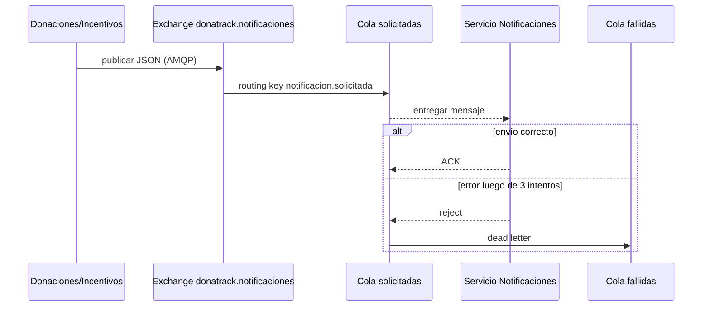
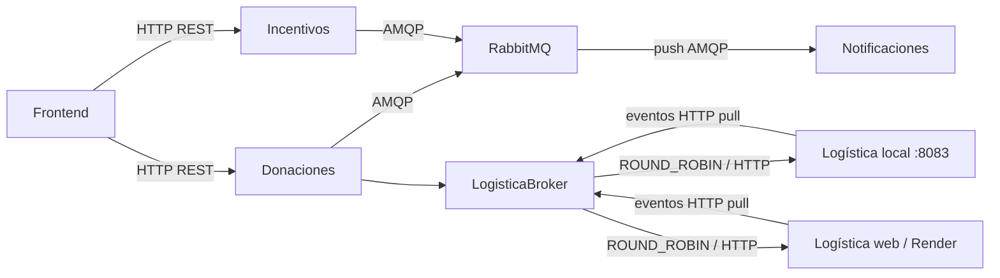
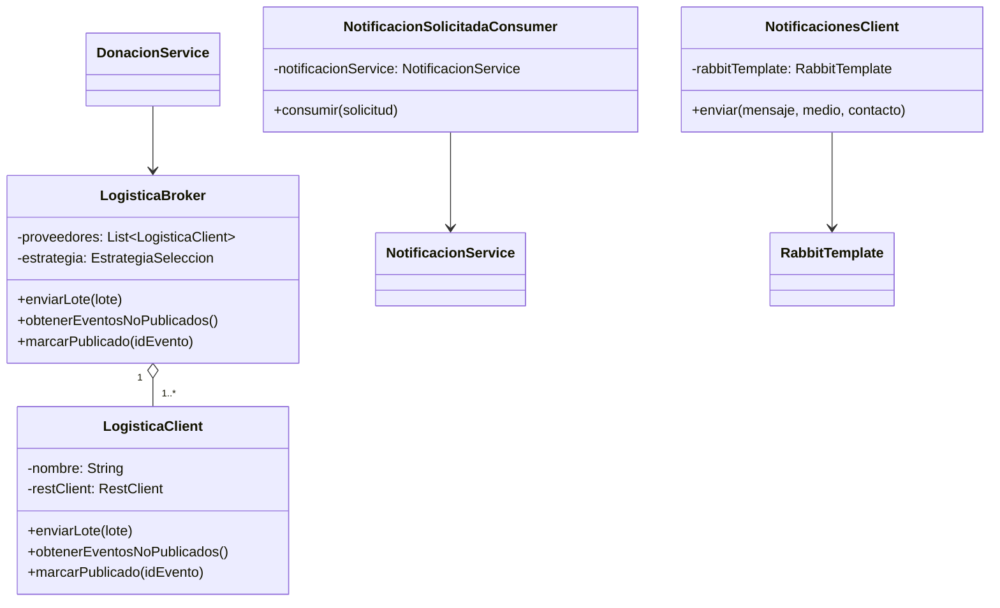

# Entrega 4 - Integración asincrónica y broker de logística

## Alcance

Esta implementación cubre los dos requerimientos de integración de la Entrega 4:

1. Los servicios de dominio solicitan notificaciones de forma asincrónica mediante una cola.
2. Donaciones se integra con más de un proveedor de logística a través de un broker.

RabbitMQ, AMQP, `ROUND_ROBIN`, los reintentos y la cola de mensajes fallidos son
decisiones de diseño del equipo. La consigna exige una cola y un broker, pero no
impone esas tecnologías ni estrategias concretas.

## Arquitectura por capas

En cada servicio se mantienen separadas las siguientes responsabilidades:

- **Dominio:** entidades y reglas del negocio. No conoce HTTP, RabbitMQ ni URLs.
- **Aplicación/servicios:** coordina los casos de uso, por ejemplo asignar una
  donación o solicitar una notificación.
- **Integración/infraestructura:** implementa la comunicación con sistemas
  externos. Aquí se encuentran `RabbitTemplate`, `@RabbitListener`,
  `LogisticaBroker` y `LogisticaClient`.
- **Presentación:** controladores REST consumidos por el frontend u otros clientes.
- **Configuración:** declara exchanges, colas, bindings, conversión JSON y
  propiedades de conexión.

Esta separación evita acoplar las reglas de negocio a RabbitMQ o a un proveedor
logístico concreto. La tecnología de integración puede cambiar sin modificar el
modelo de dominio.

## Cola de notificaciones

### Decisión

Se eligió RabbitMQ porque el problema consiste en entregar comandos discretos de
notificación a un único consumidor. RabbitMQ ofrece colas durables, confirmación
de consumo, reintentos, dead-letter queues y una interfaz web sencilla para
operación y demostración.

Kafka fue descartado porque está orientado principalmente a streams de eventos,
retención prolongada y múltiples consumidores que reproducen un historial. Esas
capacidades agregaban complejidad sin aportar valor al caso actual. ActiveMQ
también era válido, pero la integración de RabbitMQ con Spring AMQP y su consola
de administración simplifican la implementación y la defensa.

### Flujo

1. Donaciones o Incentivos construyen una solicitud con mensaje, medio, contacto
   y servicio de origen.
2. `RabbitTemplate` publica el JSON en el exchange directo
   `donatrack.notificaciones`, usando la routing key
   `notificacion.solicitada`.
3. El binding dirige el mensaje a la cola durable
   `donatrack.notificaciones.solicitadas`.
4. `NotificacionSolicitadaConsumer`, mediante `@RabbitListener`, recibe el
   mensaje y delega el envío a `NotificacionService`.
5. Si el procesamiento termina sin excepción, RabbitMQ confirma y elimina el
   mensaje.
6. Si falla, Spring reintenta hasta tres veces, con espera incremental. Agotados
   los intentos, el mensaje se rechaza y RabbitMQ lo mueve a
   `donatrack.notificaciones.fallidas`.

La integración es asincrónica: el productor no espera a que se envíe el correo,
SMS o WhatsApp. Si Notificaciones está temporalmente fuera de servicio, los
mensajes permanecen en RabbitMQ.

### Diagrama de secuencia



## Broker de logística

### Decisión

`LogisticaBroker` centraliza la selección del proveedor. Donaciones no conoce
qué URL recibe cada lote y depende únicamente del broker.

Los proveedores configurados actualmente son:

- `PROPIA`: servicio local de logística, por defecto `http://localhost:8083`.
- `ALTERNATIVA`: despliegue web, configurable mediante
  `LOGISTICA_ALTERNATIVA_URL`.

La estrategia predeterminada es `ROUND_ROBIN`: cada lote comienza por el
proveedor siguiente, distribuyendo las solicitudes alternadamente. Si el
proveedor seleccionado falla, el broker prueba el siguiente antes de informar
un error. También se conserva `FAILOVER` como estrategia configurable.

Los eventos se consultan en todos los proveedores en cada ciclo. El broker
registra qué proveedor originó cada evento para confirmar su publicación en el
mismo origen.

### Diagrama de componentes



### Clases de integración para agregar al modelo



## Configuración y despliegue local

RabbitMQ se levanta mediante:

```powershell
docker compose -f docker-compose.integration.yml up -d
```

- AMQP: `localhost:5672`
- Consola de administración: <http://localhost:15672>
- Credenciales locales: `guest` / `guest`

El compose de integración levanta solamente RabbitMQ. Los servicios Java y el
frontend se ejecutan por separado.

## Estrategia de pruebas

### Unitarias

- Alternancia de proveedores con `ROUND_ROBIN`.
- Fallback al siguiente proveedor ante un error.
- Error cuando todos los proveedores fallan.
- Consulta de eventos en todos los proveedores.
- Confirmación del evento en el proveedor que lo originó.
- Publicación del exchange, routing key y payload correctos.
- Delegación del consumer al servicio de notificaciones.

### Integración

`RabbitNotificacionesIntegrationTest` utiliza Testcontainers para iniciar un
RabbitMQ real, publicar un mensaje y verificar que `@RabbitListener` lo consuma.
La prueba se omite automáticamente si Docker no está disponible.

En una computadora con Java 17, Maven y Docker:

```powershell
git fetch origin
git switch cola-broker
mvn test
```

## Trade-offs y mejoras futuras

- La cola desacopla disponibilidad y tiempos de respuesta, pero introduce
  consistencia eventual: la notificación puede enviarse unos segundos después.
- La DLQ evita perder silenciosamente mensajes que fallan repetidamente, pero
  requiere monitoreo y un procedimiento de reintento manual.
- Para garantizar atomicidad entre persistir cambios de dominio y publicar el
  mensaje puede incorporarse el patrón Transactional Outbox.
- Para reforzar la garantía de publicación puede habilitarse publisher confirms.
- Métricas y alertas deberían controlar profundidad de la cola, reintentos y DLQ.
